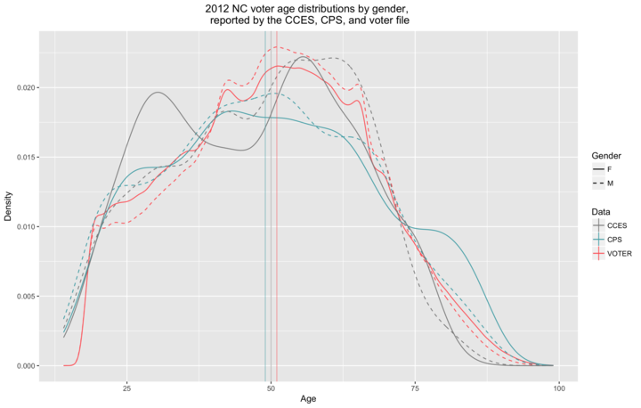
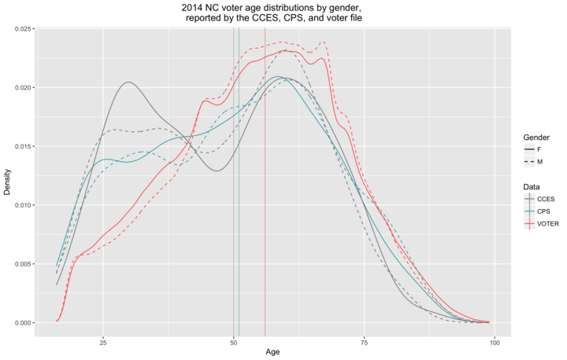
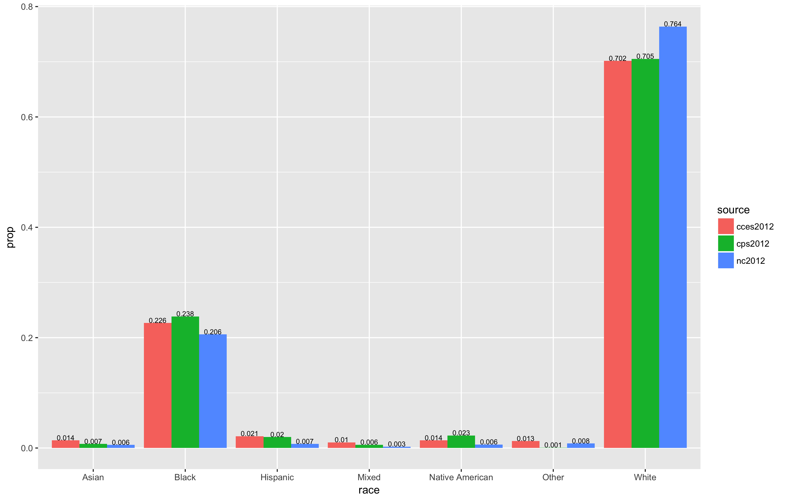
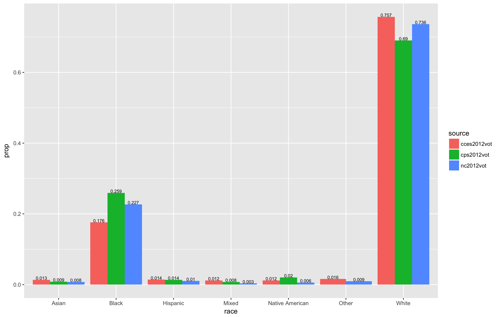
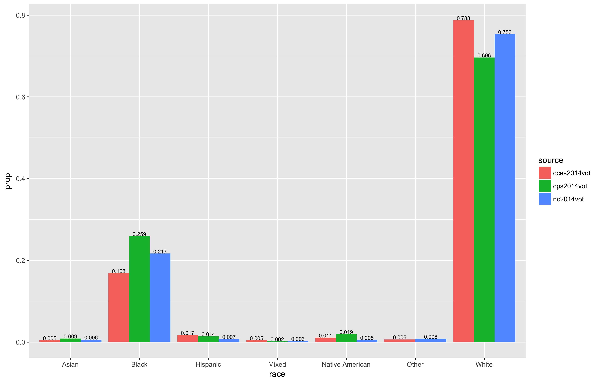
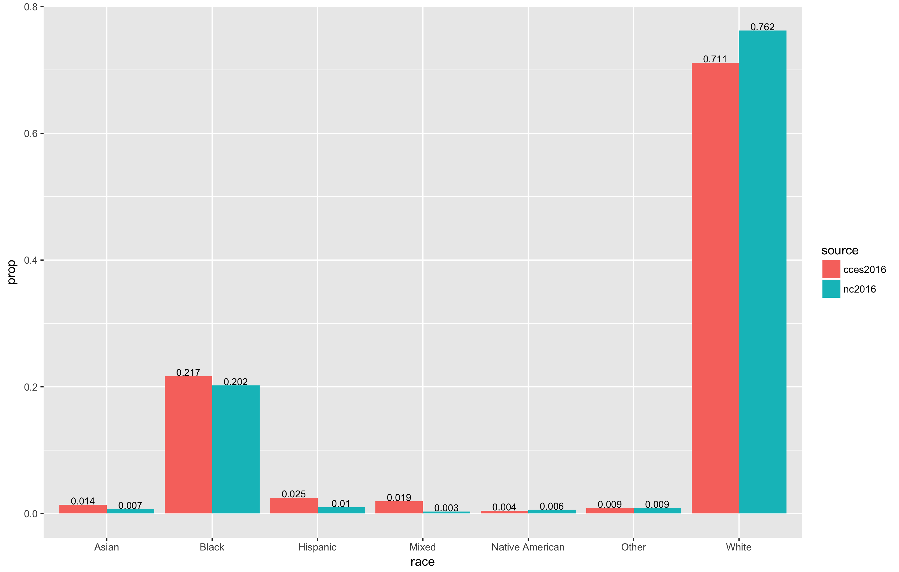
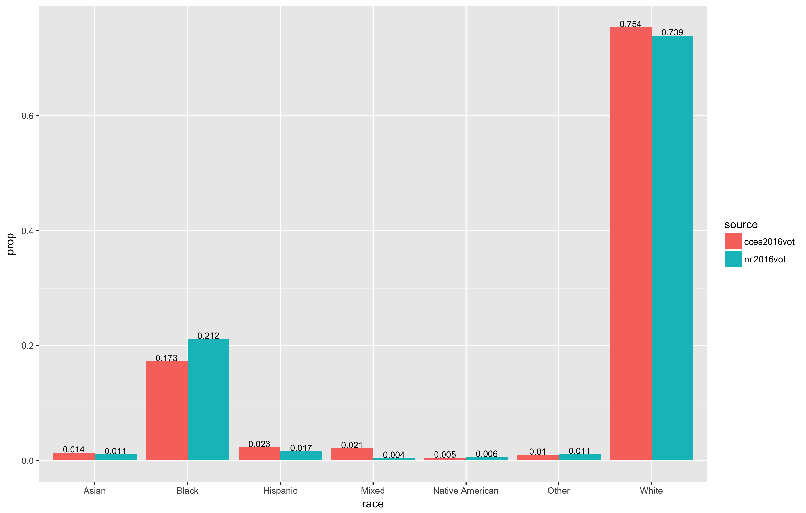

```{r setup, include=FALSE}
library(flexdashboard)
library(dplyr)
library(ggplot2)
library(shiny)
```

Introduction
=======================================================================

Column
----------
### Motivation
Our goal is to identify disparities in North Carolina voter demographics (specifically race, age, and gender) among the voter file, Current Population Survey (CPS), and Cooperative Congressional Election Study (CCES).

This is relevant to the field of election science because surveys like the CCES and the CPS are used by researchers to interpret the outcomes of elections. If the registered or voting population differs significantly from that reported by the surveys, this could have wide ranging implications for the validity of interpretations of elections. By comparing these three different data sources, we hope to find empirical evidence of the accuracy of surveys.

This app allows a user to explore these differences through subsetting the data we collected based on different demographic information. We then make several visualizations of the data to show how different groups of the population differ between sources.

Column
-------------
### Data Sources

The largest data source used in this project is the North Carolina voter file.
These data are publicly available from the [North Carolina State Board of Elections](http://dl.ncsbe.gov/index.html).
They consist of two files: the first is a voter history file, containing a record of ballots cast, and the second is a voter registration file, which contains demographic information about voters.
We also made use of the [Cooperative Congresional Election Study (CCES)](http://cces.gov.harvard.edu/).
These data are the result of a large national survey about voting behaviors.

The most difficult data to work with were the North Carolina files, mostly because of their size.
Together, the two files totaled more that 7 Gb. This is fairly small by modern data standards,
but still present problems for working locally in `R`. We worked around this by using Amazon Web Service's relational database product, RDS, to create a remote PosgreSQL instance that housed the data.
This allowed us to work remotely even using computers that were not able to load the data locally.
The code we used to download the data and create the tables is available in the GitHub repo for this project.

The [CPS](https://cps.ipums.org/cps/), or Current Population Survey, is conducted by the US Census. In years of major elections, the CPS also surveys voting and registration in the Voting and Registration supplement. Data for 2012, 2014 were obtained through the Census public database.

Survey weights are numeric values assigned to each case in a sample to make it  more representative of the sample. For example, if North Carolina has 30% white female voters yet my sample only had 10% white female a higher survey weight would be assigned to white female voters to better represent them in the sample. However in the methodolgy of assigning the CCES survey weights, the survey weights from the CPS data set were used. This implies that if there were any biasis in the survey weights assigned in the CPS, it could be carried over to the CCES data set. A full methodology of the CCES survey weight methodology can be found in each years guide at [Cooperative Congresional Election Study (CCES)](http://cces.gov.harvard.edu/).

The CCES, short for Cooperative Congressional Election Survey, the CCES seeks to find how Americans view Congress, political elections and electoral experiences. The CCES samples the US population as a whole, however asks about demographic information as well as registration status and if respondents voted in the last election which was used to filter for the samples needed. Data for 2012, 2014 and preliminary results for 2016 were obtained through CCES’ public database.


Results
=======================================================================

Column
----------
### Age and Gender

```{r}


```


The median age^[Vertical lines denote median ages, not separated by gender] in the voter file is consistently higher than the median ages reported by the CPS and CCES.

The CCES consistently over-reports younger voters, especially women in 2012 and 2014, and men in 2016.

The CPS over-reported older female voters in 2012 and younger voters in 2014, under-reporting middle-aged voters in both years.

column {.tabset} 
-----------

### Race in 2012

```{r}


```

### Race in 2014

```{r}


```

### Race in 2016

```{r}


```


Charts
=======================================================================

Sidebar {.sidebar}
-----------------------------------------------------------------------

### Parameters

Select a subset of the population:

```{r}
selectInput("race", "Race/Ethnicity", c("Black" = "Black",
                                        "Hispanic" = "Hispanic",
                                        "White" = "White",
                                        "Other" = "Other"),
            multiple = TRUE,
            selected = c("Black", "Hispanic", "White", "Other"))

selectInput("gender", "Gender", c("Male" = "Male",
                                  "Female" = "Female"),
            multiple = TRUE, selected = c("Male", "Female"))

sliderInput("age", "Age", 18, 120, c(18,120), step = 1, ticks = FALSE)

radioButtons("year", "Year", c(2012, 2014, 2016), selected = 2016)
```


Column {data-width=400}
-----------------------------------------------------------------------
### What percent of the population is voting? {.no-title}

```{r}
load("data/wrangled.RData")

get_data <- function(year){
  switch(year,
         `2012` = all_2012,
         `2014` = all_2014,
         `2016` = all_2016)
}
```

```{r}
to_plot <- reactive({
  get_data(input$year) %>%
    filter(age >= input$age[1], age <= input$age[2],
           race %in% input$race,
           gender %in% input$gender)
  
})


renderPlot({
  ggplot(to_plot(), aes(source)) +
    geom_bar(aes(fill = voted), position = "fill", na.rm = TRUE) +
    theme_bw()
})

```

> What percent of the population segment selected voted in the general election

column {.tabset}
---------

### North Carolina Voter Database

#### Registered


```{r}
renderGauge({
  nc_tot <- get_data(input$year) %>%
    filter(source == "NC",
           !is.na(race),
           !is.na(age),
           !is.na(gender)) %>% 
    nrow()
  nc_group_reg <- to_plot() %>% 
    filter(source == "NC",
           !is.na(race),
           !is.na(age),
           !is.na(gender)) %>% 
    nrow()
  
  gauge(value = round(nc_group_reg/nc_tot*100),
        min = 0,
        max = 100,
        symbol = "%")
})
```

> Proportion of registered voters in the segment according to the North Carolina voter registration data

#### Voted

```{r}
renderGauge({
  nc_tot <- get_data(input$year) %>%
    filter(source == "NC",
           voted == "Yes",
           !is.na(race),
           !is.na(age),
           !is.na(gender)) %>% 
    nrow()
  
  nc_voted <- to_plot() %>% 
    filter(source == "NC",
           voted == "Yes",
           !is.na(race),
           !is.na(age),
           !is.na(gender)) %>% 
    nrow()
  
  gauge(value = round(nc_voted/nc_tot*100),
        min = 0,
        max = 100,
        symbol = "%")
})
```

> Percent of ballots cast by members of the selected segment according to the North Carolina voter history file

#### Voting Power Index

```{r}
renderGauge({
    nc_tot <- get_data(input$year) %>%
    filter(source == "NC",
           !is.na(race),
           !is.na(age),
           !is.na(gender)) %>% 
    nrow()
    
    nc_tot_voted <- get_data(input$year) %>%
    filter(source == "NC",
           voted == "Yes",
           !is.na(race),
           !is.na(age),
           !is.na(gender)) %>% 
    nrow()
  
  nc_group_voted <- to_plot() %>% 
    filter(source == "NC",
           voted == "Yes",
           !is.na(race),
           !is.na(age),
           !is.na(gender)) %>% 
    nrow()
  
    nc_group_reg <- to_plot() %>% 
    filter(source == "NC",
           !is.na(race),
           !is.na(age),
           !is.na(gender)) %>% 
    nrow()
  
  
  gauge(round((nc_group_voted/nc_tot_voted)/(nc_group_reg/nc_tot), 2),
        0,
        2,
        symbol = " VPI")
})
```

> VPI is a measure of importance of a group of voters relative to their size

### CCES Estimates

#### Registered

```{r}
renderGauge({ 
  cces_tot <- get_data(input$year) %>% 
    filter(source == "CCES",
           !is.na(race),
           !is.na(age),
           !is.na(gender)) %>% 
    nrow()
  gauge(value = round(sum(to_plot()$source == "CCES")/cces_tot*100),
        min = 0,
        max = 100,
        symbol = "%")
})
```

> Proportion of registered voters in the segment as reported by the CCES

#### Voted

```{r}
renderGauge({ 
  cces_tot <- get_data(input$year) %>% 
    filter(source == "CCES",
           voted == "Yes",
           !is.na(race),
           !is.na(age),
           !is.na(gender)) %>% 
    nrow()
  cces_voted <- to_plot() %>% 
    filter(source == "CCES",
           voted == "Yes",
           !is.na(race),
           !is.na(age),
           !is.na(gender)) %>% 
    nrow()
  
  gauge(value = round(cces_voted/cces_tot*100),
        min = 0,
        max = 100,
        symbol = "%",
        abbreviate = TRUE)
})
```

> Percent of ballots cast by members of the segment as reported by the CCES

#### Voting Power Index

```{r}
renderGauge({
    nc_tot <- get_data(input$year) %>%
    filter(source == "CCES",
           !is.na(race),
           !is.na(age),
           !is.na(gender)) %>% 
    nrow()
    
    nc_tot_voted <- get_data(input$year) %>%
    filter(source == "CCES",
           voted == "Yes",
           !is.na(race),
           !is.na(age),
           !is.na(gender)) %>% 
    nrow()
  
  nc_group_voted <- to_plot() %>% 
    filter(source == "CCES",
           voted == "Yes",
           !is.na(race),
           !is.na(age),
           !is.na(gender)) %>% 
    nrow()
  
    nc_group_reg <- to_plot() %>% 
    filter(source == "CCES",
           !is.na(race),
           !is.na(age),
           !is.na(gender)) %>% 
    nrow()
  
  
  gauge(round((nc_group_voted/nc_tot_voted)/(nc_group_reg/nc_tot), 2),
        0,
        2,
        symbol = " VPI")
})